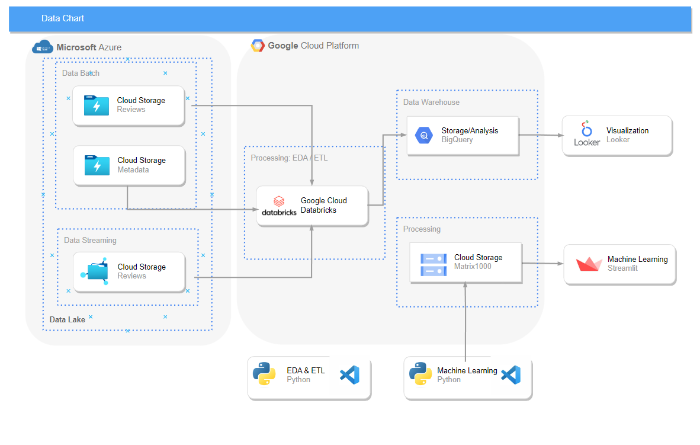

# Factored Datathon 2023

**Inteligencia Colectiva**

We have enrolled into Factored Datathon 2023 with great expectation and excitment to participate in our first data competition. 

Our Team:

- Eloy Armao - Data Engineer
- Hector Argumedo - Data Analyst
- José Jiménez - Data Engineer
- Ricardo Talavera - Data Scientist

**Technology Stack**

After reading carefully the rules of the competition, we have decided to use:

- Visual Studio
- Google Cloud Platform
- Databricks
- Looker Studio
- Streamlit
- Github

**Data Flow**

In the following image, we can see the data flow chart. 

The data is stored in Microsoft Azure and it's considered our data lake.

For this activity, there were two datasets received by batch "reviews" and "metadata", and additional data sent via streaming for "reviews".

The data is extracted via Databricks. There it was done the Exploratory Data Analysis (EDA), where it was necessary to understand the quality of the information and be able to decide how to continue. Based on the EDA, Transformation were performed and then the data was uploaded to BigQuery which worked as our Data Warehouse. 

With the information stored in our DW, we were able to connect to Looker Studio to generate the dashboards with some insights, and have the data available to run some machine learning models. 

**EDA & ETL**

EDA and ETL scripts are located in the repository. 

Some key elements to highlight:

- "reviews" batch:  ~140 million registers
- "metadata": ~15 million registers
- "reviews" streaming: ~ 60 thousands registers

**Insights**

Looker studio link

**Machine Learning**

There are two models generated:

- sentiment analysis
- recommendation system: user based

The definition of there two models is based on the importance of each. With the sentiment anaylisis, there is possibility of understanding very fast how the customers are feeling about the platform, the products, or whatever it wants to be analyzed.
The recommendation system based on user, is a very powerful tool which provides the power to the e-commerce platform to suggest/recommend products to the client based on customers with similar tastes and be able to increase the sells. 

The models are deployed on streamlit:

Access to streamlit: https://datathoninteligenciacolectiva-c7bpjvnzj4hqdwtzg9fjxc.streamlit.app
