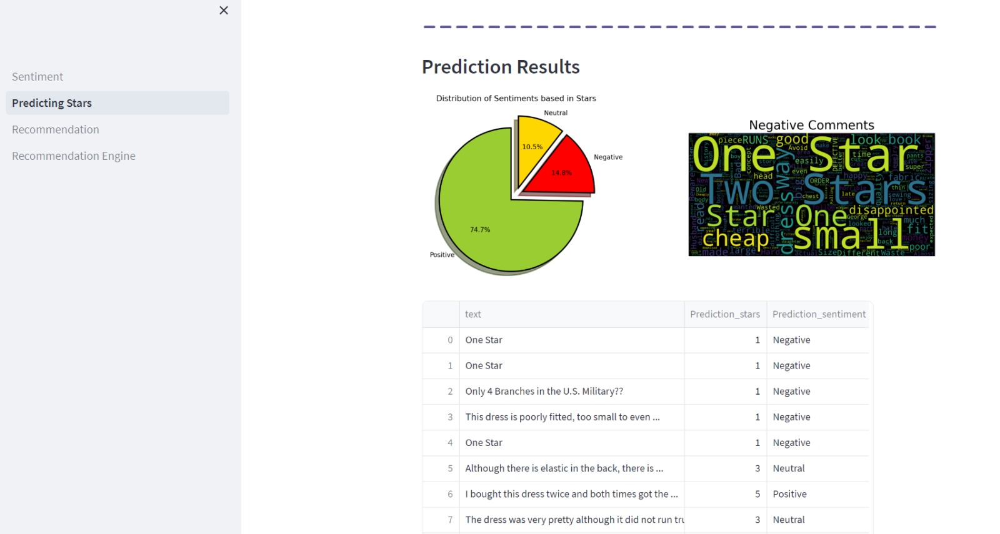

  

 <h1 align=center> AZURE AND GOOGLE CLOUD PLATAFORM INTEGRATION WITH ETL, ML AND STREAMING</h1>

## **TABLE OF CONTENTS**
- Equipment
- Introduction
- Job offer
- Resources and links provided
- Realization of the project

## **TEAM**: INTELIENCIA COLECTIVA
- Argumedo Hector - Data Analytict
- Armao ELoy - Data Engineer
- Jimenez José - Data Engineer
- Talavera Ricardo - Data Scientict

## **INTRODUCTION**

This project deals with the extraction of data about the information of Amazon products in a data set called metadata and a data set that has the criticisms and suggestions of each product called reviews, these two data sets are hosted in a datalake of azure. An ETL process was performed to clean and transform the data and load the clean data into Google BigQuery. Machine Learning techniques were applied to obtain valuable information, including sentiment analysis and recommendation system. In addition, streaming was also carried out to process and analyze data in real time. This project combines advanced data storage and analysis technologies to provide accurate and timely information from large data sets.

## **JOB OFFER**

Factored Datathon 2023
Data Sources.

In preparation for the upcoming Datathon, we have two primary sources of data to work
with, and it's essential to note that these are the only data sources available for this event.
The first source involves two batch-format tables containing valuable information and
insights related to reviews for products that customers buy on Amazon. These batch
tables are distributed in partitions and stored using JSON format files hosted in an Azure
Data Lake Storage instance. Tables Included:

-  `Amazon Product` Reviews: This is a large crawl of product reviews from Amazon. This
dataset contains 82.83 million unique reviews from around 20 million users.

-  `Amazon Metadata`: Contains the description and metadata for all products included in
the dataset.
The second source involves Amazon Product Reviews, available in streaming mode,
offering real-time data updates. The streaming topic continuously receives new data as it
becomes available, enabling us to stay up-to-date with the latest developments.
The challenge for the Datathon is to effectively combine the data from both sources and
use them as sources for analytics and machine learning purposes. Please take into
consideration the objectives that are defined for the Data Engineering section to be sure
that the solution that your team is proposing is compliant.

Integrating the batch and streaming tables allows you to understand review data better,
leveraging static and dynamic data advantages. This combined approach will enable you
to extract valuable patterns, trends, and correlations, enhancing our ability to develop
innovative and impactful solutions during the hackathon.

## **RESOURCES AND LINKS PROVIDED**

Technology Stack. After reading carefully the rules of the competition, we have decided to use:

+ Databricks
+ Google Cloud Platform
+ Looker Studio
+ Streamlit
+ Github

Documentation to extract ADLS information using SAS Tokens:
- https://docs.databricks.com/storage/azure-storage.html#language-SAS%C2%A0tokens

- https://pypi.org/project/azure-storage-file-datalake

Documentation Reference to Read Event Hub Data:

- https://learn.microsoft.com/en-us/azure/event-hubs/event-hubs-python-get-started-send?tabs=passwordless%2Croles-azure-portal

## **DATA FLOW**

  

## **PROJECT REALIZATION**

### **`Part 1). INSTALLED OF LIBRARIES, ETL AND EDA`**:

The entire project was done in the cloud. Databricks was our starter. The necessary libraries were installed for the download of the archive, processing, normalization, cleaning and loading of the data, such as:

+ azure-eventhub 
+ azure-storage-blob
+ google-cloud
+ google-cloud-bigquery

For the ETL, one of the metadata and reviews files was used since the data was very large.

Some key elements to highlight:

- "reviews" batch: ~140 million registers
- "metadata": ~15 million registers
- "reviews" streaming: ~ 60 thousands registers

To solve the problem of doing the ETL process to the entire mega data structure, it was carried out on each of the files to be later stored in the Google BigQuery platform.

The Batch_ETL.ipynb file details the steps performed on a partition of the data "amazon_metadata/partition_10", and then a for loop is created to extract each file from the datalake where various transformations are applied and then each file is uploaded to the platform

This process is carried out in a similar way to an archive of the reviews data, it can also be observed in the aforementioned archive

### **`Part 2). THE ANALYSIS PRESENTED IN THE DOCUMENT`**:

 **Datathon_-_Amazon_Data_Analytics.pdf** focuses on studying reviews and metadata related to products that customers purchase on Amazon. The analysis is divided into several sections, each with a specific focus.

 

1. **Number of Reviews per Rating:** This section shows the distribution of the number of reviews based on the ratings received by the products. The quantity of reviews for each rating from 1 to 5 stars is observed.

2. **Summary by Customer:** Here, a summary of the most used reviews by customers is presented, grouped by specific terms. For example, it displays the most frequent reviews with terms like "Love it," "Excellent," "Perfect," among others.

3. **Most Used Reviews:** The total count of the most used reviews in the analysis is provided, giving an overview of the most common trends in customer opinions.

4. **Top Critics:** This section shows the percentage of reviews made by top critics, identified by their usernames on Amazon. It reveals how much these critics contribute to the total number of reviews.

5. **Main Categories:** The major product categories available on Amazon, such as books, fashion, home, sports, automotive, among others, are presented.

6. **Number of Products per Main Category:** This section displays the quantity of products available in each of the main categories. For instance, it shows how many products are in the fashion or electronics category.

7. **Average Number of Images per Title:** The average number of images associated with each product title is provided, indicating the amount of visual content available to customers.

8. **Best Selling Brands:** Brands with the maximum and minimum prices of their products are identified, along with the total number of products sold for each brand.

9. **Secondary Categories:** The secondary product categories that complement the main categories are displayed.

  

Overall, the analysis aims to understand customer behavior in providing product reviews, identify purchase patterns and trends, and explore potential relationships between ratings and product features. The analysis also highlights the importance of data, from which insights are drawn to gain a complete and accurate understanding of Amazon customer behavior.

As a discovery, it's books that sell the most, no matter how many images of the product are posted, as long as there are images posted. 
Most of the reviews are positive, from a sample of approximately 140,000,000 records, more than 110,000,000 correspond to 4 and 5 stars. While the negatives mainly come from disgust regarding the quality and size.
Considering the number of reviews, 80% of them are signed as Amazon Customers and not with a username, possibly preferring anonymity for reasons unknown to us.

For a better understanding of the data, you can review our PDF file ([link](Datathon_-_Amazon_Data_Analytics.pdf)) and, for users with permissions, they can enter Looker to be able to interact with them at the following link: [LOOKER - DASHBOARD](https://lookerstudio.google.com/reporting/50ea6d94-c3a1-4a65-ac27-b9b1de1c9271)

### **`Part 3). ML PROCESS`**

### **`Sentiment Analysis`**. 

In this case, to perform Sentiment Analysis, the following options were available:

-  Building a custom deep learning model, where sentiment scores were derived from customer-provided star ratings for items. Subsequently, these sentiment scores were used to train a neural network.

- Utilizing the models offered by the GCP cloud, either through Big Query or via VERTEX.

- Employing pre-trained open-source models from Hugging Face, commonly referred to as Transformers.

The sentiment analysis machine learning models offered by BigQuery in GCP were evaluated, yielding an accuracy of around 86%. However, the confusion matrix revealed that the models obtained through this approach could only effectively differentiate positive comments. This high accuracy was primarily due to the prevalence of positive comments. Therefore, a star classification model from Hugging Face was employed, and the outcome was subsequently translated into sentiment. This model was ultimately adopted due to its more evenly distributed accuracy along the diagonal of the confusion matrix.

Finally, the model was deployed on Streamlit, providing the option to evaluate the model either at the level of a single sentence or with a CSV file.

  

  

You can test sentiment analysis at the file level using the file: test2.csv, which is also attached on GitHub.

### **`Recommendation Model`**

In this case, we leveraged the availability of item categories in the metadata, as well as user rating information for each item. We encountered the following options:
- Choosing the matrix factorization SVM model offered by BigQuery.
 
- Building a proprietary model using a specific algorithm.
We opted for the in-house construction of a model, as the version provided by BigQuery was exclusively for paid users.

For the construction of the model, the following steps were undertaken:

  - A binary matrix of products and categories was obtained.

  - The user rating matrix for each product was acquired, with unrated items being filled with zeros.

  - The user's vectorized profile was generated by performing dot multiplication between the mentioned matrices.
  
  - The normalized profile vector of the client was multiplied by the binary vectors of unseen items.

  - The summation of each resulting vector provided a ranking that prioritizes recommended items for the user.

  - This process culminated in a recommendation ranking that caters to the user's preferences.

Finally, in order to be deployed on Streamlit, the decision was made to focus on the top 1000 customers who provide the most feedback and the top 1000 most voted items. This approach aims to enhance the efficiency and responsiveness of the recommendation system within the Streamlit interface.

  

### **`Part 4). THE MODELS ARE DEPLOYED ON STREAMLING`**

Access to streamlit: https://datathoninteligenciacolectiva-c7bpjvnzj4hqdwtzg9fjxc.streamlit.app

